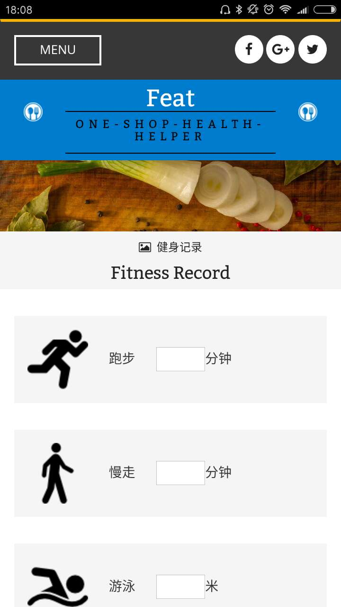

# Feat: a one-shop health meal app

Feat is a one-shop health meal app template.

# A glance

Feat Daily News


Navigation


Fitness record




# Install

First you have to install a apache or nginx server to give the app service. If you don't have, see [this](https://httpd.apache.org/) link.

Then clone the repo into your web service folder.

```bash
    cd your/web/service/folder
    git clone https://github.com/Jackey-Huo/Feat.git
```

Now you can access the web site in your own browser.

Typing "http://localhost/Feat/sign-in.html" to start visit the web!

